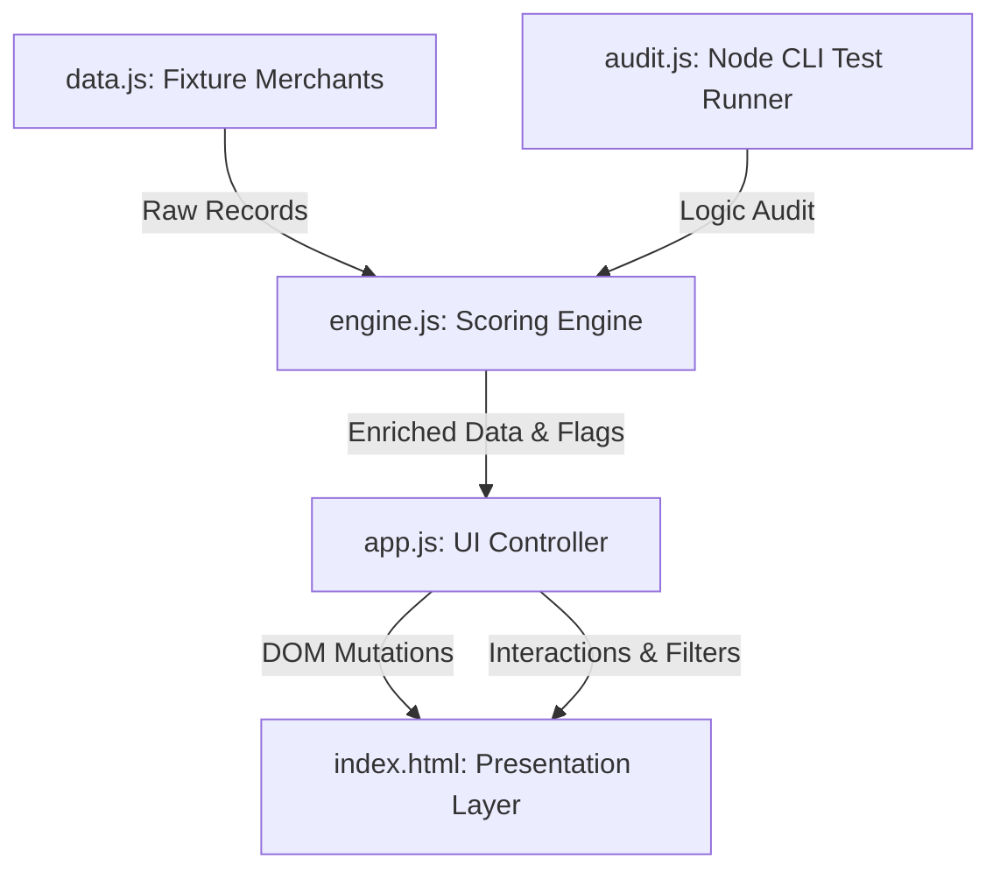

# System Design, Directory Structure, and Logic Specs

## 1. System Design Architecture

The dashboard is structured as a decoupled Single Page Application (SPA). To maintain zero external dependencies and ensure direct local deployment (e.g., via GitHub Pages), the architecture separates data declarations, scoring logic, and UI binding:



---

## 2. Directory Structure

```
merchant-churn-dashboard/
├── docs/
│   ├── purpose_and_research.md    # Business context, sources & rationale
│   ├── system_design.md           # Architecture, logic formulas & schema
│   ├── ui_ux_presentation.md      # UI guidelines, color tokens & drawer specs
│   └── antigravity_context.md     # Context guide for coding AI agents
├── index.html                     # Responsive dashboard UI shell
├── style.css                      # Core design system stylesheet
├── data.js                        # 18 hand-authored merchant fixtures
├── engine.js                      # Math and signal detection functions
├── app.js                         # Event listeners and DOM rendering
├── audit.js                       # CLI test runner to prevent regressions
└── README.md                      # Deployment & developer documentation
```

---

## 3. Mathematical Specifications (Scoring Logic)

### A. Contact Gap Baseline
Let \(T = \{t_1, t_2, \dots, t_n\}\) be the set of tickets for a merchant, sorted chronologically by date where \(d(t_i)\) represents the date of ticket \(t_i\).
The average historical contact gap (in days) is defined as:
\[\mu_{\text{gap}} = \frac{1}{n-1} \sum_{i=2}^{n} \left( d(t_i) - d(t_{i-1}) \right)\]
If \(n < 2\), the gap baseline cannot be derived (\(\text{null}\)).

### B. "Went Silent" Detection
A merchant is flagged as silent if the time since their last ticket \(t_n\) exceeds twice their average contact gap:
\[\text{Today} - d(t_n) > 2 \times \mu_{\text{gap}}\]

### C. Moving Sentiment Average (90d)
Let \(R_{90}\) be the subset of tickets created in the last 90 days. The average sentiment score is:
\[\mu_{\text{sentiment}} = \frac{1}{|R_{90}|} \sum_{t \in R_{90}} \text{sentiment}(t)\]
The signal is triggered if \(\mu_{\text{sentiment}} < -0.2\).

### D. Escalation Spike Detection
Let \(E_{90}\) be the count of escalated tickets in the last 90 days, and \(E_{180\setminus90}\) be the count of escalated tickets in the prior 90–180 days.
The signal is triggered if:
\[E_{90} \ge 3 \quad \text{and} \quad E_{90} > E_{180\setminus90}\]

### E. Composite Risk Score
The composite risk score \(S\) is the sum of weighted active signals:
\[S = 30 \cdot \mathbb{I}(\text{Escalation Spike}) + 25 \cdot \mathbb{I}(\text{Went Silent}) + 20 \cdot \mathbb{I}(\text{Low CSAT/NPS}) + 15 \cdot \mathbb{I}(\text{Backlog}) + 10 \cdot \mathbb{I}(\text{Sentiment Decline})\]
where \(\mathbb{I}(\cdot)\) is the indicator function (1 if true, 0 if false).
- \(S \ge 50 \implies\) **High Risk**
- \(25 \le S < 49 \implies\) **Medium Risk**
- \(S < 25 \implies\) **Low Risk**
